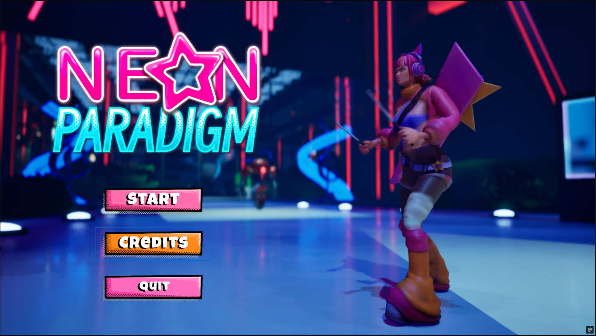
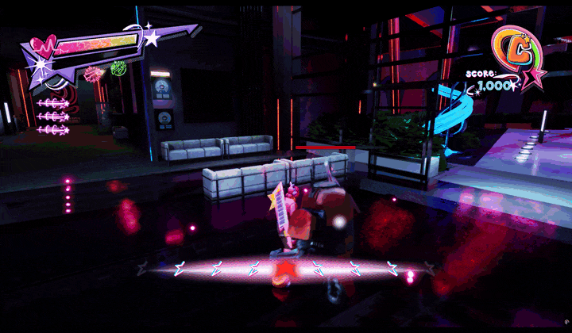

# 🎮 Neon Paradigm

*Neon Paradigm is a hack-and-slash rhythm game that challenges players to time their attacks and dodges to the beat of the music. It features responsive combat, dynamic audio, and custom shaders that come together to create a fast-paced, immersive experience.*

---

## 📑 Table of Contents

- [Project Description](#-project-description)  
- [Core Features](#-core-features)  
- [Feature Breakdown](#-feature-breakdown)  
- [Technology Used](#-technology-used)  
- [Developer Role](#-developer-role)  
- [Development Insights](#-development-insights)  
- [Lessons Learned](#-lessons-learned)  
- [Screenshots & Gameplay Preview](#-screenshots-&-gameplay-preview)  

---

## 📌 Project Description

**Neon Paradigm** is a senior thesis project developed at the **University of the Incarnate Word**. Built in **Unreal Engine 5 using C++ and Blueprints**, the game combines hack-and-slash action with rhythm mechanics. Players must perform attacks, dodges, and movements on the beat to maximize damage, combos, and style.

The game uses **FMOD Studio** for adaptive, dynamic audio—syncing gameplay actions and enemy behavior to music in real time. To further immerse players, **custom shaders and visual effects** react to beats and combos, enhancing moment-to-moment feedback and timing.

The project was developed in collaboration with a team of **3D modelers and animators**, who helped bring the game world and its characters to life through stylized environments and expressive animation. Their creative contributions were tightly integrated into the gameplay systems to ensure rhythm and visuals worked in harmony.

This project reflects a complete blend of **gameplay systems programming**, **real-time audio integration**, **team collaboration**, and **visual design**.

---

## 🎮 Core Features

- 🎵 **Rhythm-Based Combat** – Players attack and dodge in sync with the beat to deal increased damage, build combos, and earn timing bonuses  
- ⚔️ **Hack-and-Slash Mechanics** – Features responsive light/heavy attack chains tied to rhythmic input windows  
- 🔊 **FMOD Integration** – Uses FMOD timeline callbacks and beat data to synchronize gameplay elements with music in real time  
- ✨ **Custom Shader Work** – Authored shaders in Unreal Engine for both beat-reactive visuals and procedural effects, including textures that respond to player movement and gameplay events  
- 🧠 **On-Beat Feedback System** – Implements real-time rhythm accuracy detection and scoring system for responsive player feedback  
- 🎓 **Thesis-Level Scope** – Developed as part of a senior thesis, with full programming responsibilities handled independently in collaboration with artists and animators

---

## ⚙️ Feature Breakdown

| Feature                | Description                                                                                  |
|------------------------|----------------------------------------------------------------------------------------------|
| 🎯 Rhythm Input System | Custom beat-tracking and input timing logic tied to FMOD's timeline for responsive gameplay |
| 🧱 Modular Combo Chains| Inheritance-based attack system with rhythm-sensitive branching and combo logic             |
| 🧠 Enemy AI            | Telegraphed attacks synced to beat phases, using animation blending and anticipation cues   |
| 🔄 FMOD Audio Triggers | FMOD events drive game logic, triggering VFX, and UI feedback in sync with music |
| 💥 Shader FX           | Custom-authored shaders including beat-reactive emissive pulses, and procedural textures driven by player movement or gameplay events |

---

## 🛠️ Technology Used

- **Unreal Engine 5** – Core game engine used for development and project integration  
- **C++ & Blueprints** – Developed all gameplay systems, animation logic, and combat mechanics  
- **FMOD Studio** – Integrated timeline callbacks and dynamic music-driven events with tempo syncing  
- **HLSL / Material Editor** – Authored shaders for visual effects, beat-reactive elements, and procedural textures  
- **GitHub** – Used for personal version control and off-campus development tracking  
- **Perforce** – Team-based version control used during school with a shared server for asset locking and collaboration  

---

## 👤 Developer Role

This game was developed by **Joseph Hernandez** as a solo programmer with collaboration from other student artists and designers.

- Designed and programmed all core systems (C++, Blueprint)  
- Integrated FMOD and developed beat-based sync architecture  
- Implemented visual feedback using custom shaders and animation notifies  
- Coordinated with teammates and managed scope/deliverables  
- Optimized gameplay systems for feel, clarity, and audio sync reliability

---

## 🧠 Development Insights

- Developed a custom system for syncing inputs to beat timing using FMOD timeline callbacks  
- Balanced responsiveness and difficulty by fine-tuning input windows and beat tolerance  
- Refactored gameplay logic using OOP principles for maintainability and reuse  
- Worked with animation blueprints and state machines to ensure precise visual feedback  
- Learned FMOD's API deeply to communicate with game state and build real-time audio logic  
- Managed polish phase with shader experimentation and performance testing

---

## 💡 Lessons Learned

- Gained deeper understanding of real-time audio programming and event-driven systems  
- Learned to balance creative vision with technical feasibility in a limited development cycle  
- Strengthened communication and planning skills by collaborating cross-discipline  
- Developed confidence in working with complex engine-level features like shader code and animation blueprints
- Learned to solve an engine-level crash by reviewing crash logs across GitHub commits, narrowing it down to specific scene objects (e.g., lights or post-process volumes), and resolving the issue through targeted rollback and testing  

---

## 🖼️ Screenshots & Gameplay Preview

### 📸 Main Menu Screenshot  

---

### 🎮 Gameplay GIFs

**⚔️ Combat **  
  
  
  

---

**✨ Shader Effects & Feedback**  
  
  

---

**🎬 Boss**  

